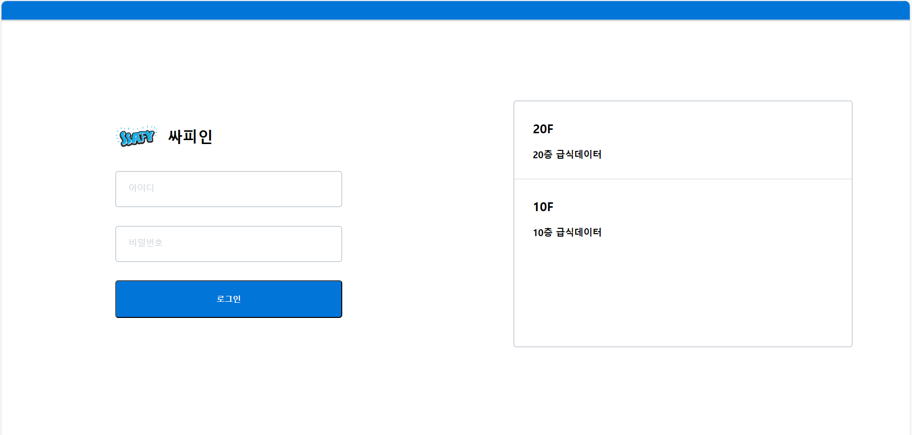

# 급식알림이
### 진행 날짜: 2024.03.20 - 04.03
역할|Front End|Back End
---|---|---
팀원|주소영|김성현
git|[address0](https://github.com/address0)|[kim-caron](https://github.com/kim-caron)
### 실행 환경
python 3.9
### Tech
- BackEnd  
<a href="https://www.python.org/" target="_blank"></a>
<a href="https://www.djangoproject.com/" target="_blank"></a>
- FrontEnd  
<a href="https://www.acmicpc.net/user/soyong32" target="_blank"></a>
<a href="https://developer.mozilla.org/ko/docs/Web/CSS" target="_blank"></a>
## 1. 구현사항
### FE
- django의 templates 폴더에 화면을 구성해 주세요.
- 바닐라 HTML/CSS를 활용하여 아래 figma에 디자인된 2개 페이지와 비슷하게 구성해 주세요.
  - 라이브러리를 사용할 경우(CDN) 그 이유를 README에 작성해 주세요.
- 최상단 폴더에 README.md를 구성하고 소개해 주세요.
- 첫 페이지 로딩 시 우측 컨테이너에 급식 정보를 로딩시켜 보세요.
### BE
- Django의 MTV 패턴을 활용하여 급식정보를 반환해야 합니다.
- form action request에 대해 적절한 페이지로 id, password를 response로 보내주세요.
- 최상단 폴더에 README.md를 구성하고, API 명세를 작성해 주세요.
### 선택 구현사항
- FE: 로그인 버튼을 누르면 login 페이지로 이동되도록 구성하고, index page input field에 담긴 정보가 로그인 화면에 나오게 구성해 보세요.
- BE: 로그인 input에 대해 정규표현식으로 검사해 보세요.
## 2. 사용 방법
```bash
# 1. 가상환경에서 필수 라이브러리 설치
python -m venv venv
source venv/Scripts/activate
pip install -r requirements.txt

# 2. DB 마이그레이션
python manage.py makemigrations
python manage.py migrate

# 3. 서버 실행
python manage.py runserver

# 4. Root Url
http://127.0.0.1:8000/articles/
```
## 3. API 명세서(BE 작성)
|index|기능|HTTP Method|API Path|담당자|설명|
|-----|----|-----------|--------|------|---------|
|[회원]|로그인|`POST`|`accounts/login`|[kim-caron](https://github.com/kim-caron)|forms.py로 인증 구현|
|[회원]|급식 정보|`GET`|`articles/index`|[kim-caron](https://github.com/kim-caron)|급식 정보 JSON 파일을 DB에 저장, 메인 페이지에 넘겨줌|

## 4. 페이지 소개(FE 작성)

> 홈페이지 디자인: 좌측은 로그인 화면, 우측은 급식 데이터 로드 화면. 로그인 버튼 클릭 시 로그인 페이지로 이동


> 로그인 페이지 디자인: 로그인 화면에서 데이터 전달받아 출력. '홈으로 돌아가기' 버튼 클릭 시 홈페이지로 이동

**각 페이지는 모두 Responsive Web으로 제작되었습니다.**